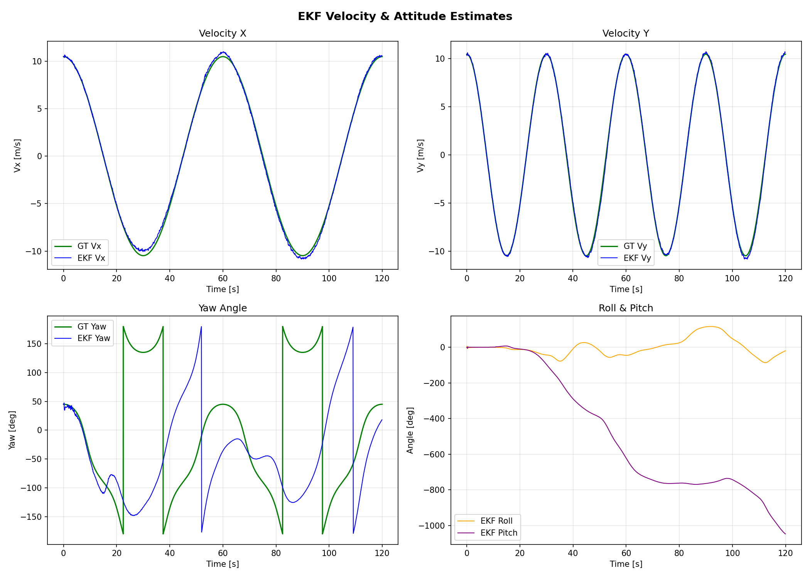
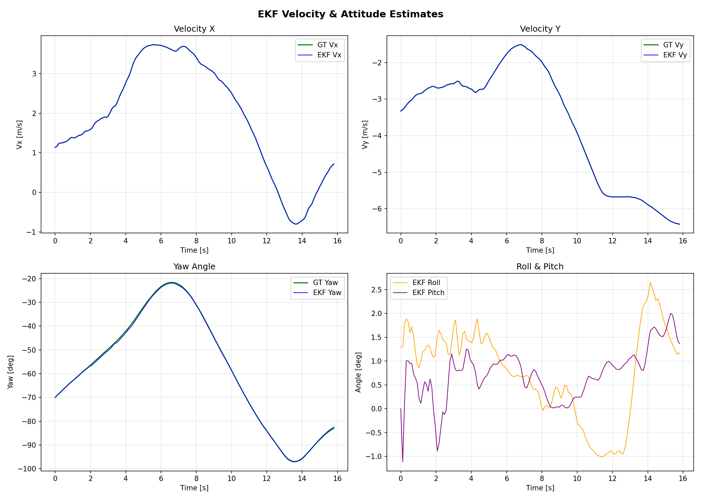

# EKF IMU + GPS Sensor Fusion

A C++ implementation of a **15-state Extended Kalman Filter (EKF)** for fusing **IMU** (accelerometer + gyroscope) and **GPS** (position + velocity) measurements for vehicle localization.

## Overview

This project estimates a vehicle's position, velocity, and attitude by combining high-rate IMU dead reckoning with lower-rate GPS corrections. It supports both **simulated (fake) data** and **real KITTI dataset** recordings.

- **IMU (Prediction)** — Body-frame accelerometer and gyroscope readings propagate the state at high rate
- **GPS (Update)** — Position and velocity measurements correct accumulated IMU drift at lower rate
- **Bias Estimation** — The filter simultaneously estimates accelerometer and gyroscope biases online

## State Vector & EKF Mathematics

**State Vector (15-state):**

| Index | State | Description |
|-------|-------|-------------|
| 0-2   | px, py, pz | Position [m] |
| 3-5   | vx, vy, vz | Velocity [m/s] |
| 6-8   | roll, pitch, yaw | Attitude (Euler angles) [rad] |
| 9-11  | bax, bay, baz | Accelerometer bias [m/s^2] |
| 12-14 | bgx, bgy, bgz | Gyroscope bias [rad/s] |

**Prediction Step (IMU):**
```
Bias-corrected measurements:
  a_body = a_imu - b_a
  w_body = w_imu - b_g

State propagation:
  p_new = p + v * dt + 0.5 * (R * a_body + g) * dt^2
  v_new = v + (R * a_body + g) * dt
  att_new = att + w_body * dt

Jacobian F (15x15):
  dp/dv = I * dt
  dv/datt = -[R * a_body]_x * dt
  dv/dba = -R * dt
  datt/dbg = -I * dt
```

**Update Step (GPS):**
```
Measurement:  z = [px, py, pz, vx, vy, vz]  (velocity optional)
Observation:  H = [I_3x3  0  0  0  0]   (position rows)
                  [0  I_3x3  0  0  0]   (velocity rows)

Standard Kalman update:
  y = z - H * x           (innovation)
  S = H * P * H^T + R     (innovation covariance)
  K = P * H^T * S^-1      (Kalman gain)
  x = x + K * y           (state update)
  P = (I - K*H) * P * (I - K*H)^T + K * R * K^T   (Joseph form)
```

## Project Structure

```
02.EKF-IMU-GPS-Fusion-CPP/
├── CMakeLists.txt
├── README.md
├── src/
│   ├── ekf_types.h              # Data structures (ImuMeasurement, GpsMeasurement, GroundTruth)
│   ├── ekf_imu_gps.h            # 15-state EKF implementation (predict + updateGps)
│   ├── data_loader.h             # CSV data loader for IMU, GPS, and ground truth
│   ├── main.cpp                  # EKF fusion pipeline — load, filter, evaluate, export
│   ├── generate_fake_data.cpp    # Synthetic figure-8 trajectory generator
│   ├── plot_results.py           # Matplotlib visualization (trajectory, error, velocity, attitude)
│   └── convert_kitti.py          # KITTI raw oxts → project CSV converter
├── data/
│   ├── fake_data_output/         # Simulated data results
│   │   ├── imu.csv, gps.csv, ground_truth.csv
│   │   ├── ekf_output.csv
│   │   ├── ekf_results.png
│   │   └── ekf_velocity_attitude.png
│   └── kitti_data_output/        # KITTI dataset results
│       ├── imu.csv, gps.csv, ground_truth.csv
│       ├── ekf_output.csv
│       ├── ekf_results.png
│       └── ekf_velocity_attitude.png
└── build/
```

## Setup

### Prerequisites
```bash
sudo apt install libeigen3-dev python3-matplotlib python3-numpy
```

### Build
```bash
cd 02.EKF-IMU-GPS-Fusion-CPP
mkdir -p build && cd build
cmake .. && make -j$(nproc)
```

## How to Run

### Option 1 — Simulated (Fake) Data

Generate a **figure-8** trajectory with synthetic IMU (100 Hz) + GPS (10 Hz) noise:

```bash
cd build
./generate_fake_data                          # generates data/imu.csv, gps.csv, ground_truth.csv
./ekf_imu_gps_fusion ../data/fake_data_output # run EKF fusion
cd .. && python3 src/plot_results.py data/fake_data_output  # plot results
```

### Option 2 — KITTI Dataset (Real Data)

Download a KITTI raw drive and convert the oxts (IMU+GPS) data:

```bash
# 1. Download (example: drive_0005)
cd data
wget https://s3.eu-central-1.amazonaws.com/avg-kitti/raw_data/2011_09_26_drive_0005/2011_09_26_drive_0005_sync.zip
unzip 2011_09_26_drive_0005_sync.zip

# 2. Convert oxts → project CSV format
cd ..
python3 src/convert_kitti.py data/2011_09_26_drive_0005_sync

# 3. Run EKF + plot
cd build && ./ekf_imu_gps_fusion ../data/kitti_data_output
cd .. && python3 src/plot_results.py data/kitti_data_output
```

## Results

### Fake Data (Figure-8 Trajectory)

| Metric | Value |
|--------|-------|
| 2D Position RMSE | **0.28 m** |
| IMU Rate | 100 Hz (12000 samples) |
| GPS Rate | 10 Hz (1200 samples) |
| Duration | 120 s |




### KITTI Dataset (drive_0005)

| Metric | Value |
|--------|-------|
| 2D Position RMSE | **0.80 m** |
| OxTS Rate | 10 Hz (154 frames) |
| Duration | ~16 s |




## Auto-Tuning

The EKF automatically detects the IMU sample rate and selects appropriate noise parameters:

| Parameter | High-Rate (>=50 Hz) | Low-Rate (<50 Hz, KITTI) |
|-----------|---------------------|--------------------------|
| sigma_acc | 0.5 | 2.0 |
| sigma_gyro | 0.01 | 0.05 |
| sigma_gps_pos | 1.5 m | 0.3 m |
| sigma_gps_vel | 0.15 m/s | 0.05 m/s |

## Dependencies

- [Eigen3](https://eigen.tuxfamily.org/) — Linear algebra
- [Python3](https://www.python.org/) + [NumPy](https://numpy.org/) + [Matplotlib](https://matplotlib.org/) — Plotting
- [CMake 3.10+](https://cmake.org/) — Build system
