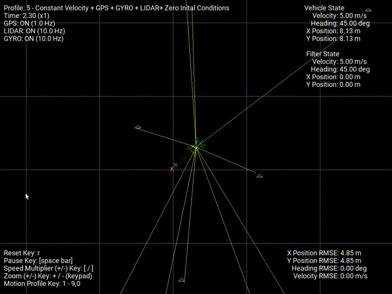

# Advanced Kalman Filtering and Sensor Fusion Tutorial

An educational C++ simulation framework for learning and implementing **Linear Kalman Filters (LKF)**, **Extended Kalman Filters (EKF)**, and **Unscented Kalman Filters (UKF)** applied to 2D vehicle state estimation with multi-sensor fusion.



## Overview

This project provides a hands-on tutorial for understanding Kalman filtering techniques commonly used in autonomous vehicle navigation. The simulation estimates vehicle state (position, heading, velocity) by fusing data from three sensor types:

- **GPS** — 2D position measurements with configurable noise and GPS-denied zones
- **Gyroscope** — Yaw rate measurements with bias and noise
- **LIDAR** — Range and bearing measurements to known landmarks with data association

The real-time 2D visualization (built with SDL2) displays vehicle trajectories, filter estimates, covariance ellipses, and error tracking plots.

## Project Structure

```
.
├── README.md
├── PDF/                                    # Theory summaries & exercise worksheets
│   ├── Linear+Kalman+Filter+Summary.pdf
│   ├── Extended+Kalman+Filter+Summary.pdf
│   ├── Unscented+Kalman+Filter+Summary.pdf
│   ├── Setting_up_the_C_Development_Environment.pdf
│   ├── Linear+Vehicle+Tracker+*+Exercise.pdf    (3 exercises)
│   ├── 2D+Vehicle+EKF+*+Exercise.pdf            (2 exercises)
│   └── 2D+Vehicle+UKF+*+Exercise.pdf            (2 exercises)
│
└── workspace/AKFSF-Simulation-CPP/         # C++ simulation source code
    ├── CMakeLists.txt
    ├── src/
    │   ├── main.cpp                        # Entry point & SDL2 setup
    │   ├── simulation.h/cpp                # Simulation orchestrator
    │   ├── display.h/cpp                   # SDL2 rendering
    │   ├── car.h                           # Vehicle kinematic model
    │   ├── sensors.h/cpp                   # GPS, Gyro, LIDAR simulation
    │   ├── beacons.h/cpp                   # Landmark map for LIDAR
    │   ├── kalmanfilter.h/cpp              # Filter interface (active impl)
    │   ├── kalmanfilter_lkf_student.cpp    # LKF student template
    │   ├── kalmanfilter_lkf_answer.cpp     # LKF reference solution
    │   ├── kalmanfilter_ekf_student.cpp    # EKF student template
    │   ├── kalmanfilter_ekf_answer.cpp     # EKF reference solution
    │   ├── kalmanfilter_ukf_student.cpp    # UKF student template
    │   ├── kalmanfilter_ukf_answer.cpp     # UKF reference solution
    │   └── utils.h/cpp                     # Math utilities
    └── data/
        └── Roboto-Regular.ttf              # UI font
```

## Getting Started

### Prerequisites

- Ubuntu 20.04+ (or compatible Linux distribution)
- CMake 3.10+
- C++11 compatible compiler

### Install Dependencies

```bash
sudo apt install libeigen3-dev libsdl2-dev libsdl2-ttf-dev
```

### Build & Run

```bash
cd workspace/AKFSF-Simulation-CPP
mkdir build && cd build
cmake ../
make
./AKFSF-Simulation
```

## How to Use

Each filter type has a **student template** and a **reference answer** file. The workflow:

1. Read the corresponding PDF theory summary and exercise worksheet
2. Copy the student template (e.g. `kalmanfilter_lkf_student.cpp`) over `kalmanfilter.cpp`
3. Implement the Kalman filter equations following the exercise guidance
4. Build and run the simulator to test your implementation
5. Compare with the answer file when needed

## Simulation Profiles

Press number keys `1`-`9`, `0` during simulation to switch profiles:

| Key | Motion Profile | Sensors | Notes |
|-----|---------------|---------|-------|
| 1 | Constant Velocity | GPS + GYRO | Zero initial conditions |
| 2 | Constant Velocity | GPS + GYRO | Non-zero initial conditions |
| 3 | Constant Speed | GPS + GYRO | — |
| 4 | Variable Speed | GPS + GYRO | — |
| 5 | Constant Velocity | GPS + GYRO + LIDAR | Zero initial conditions |
| 6 | Constant Velocity | GPS + GYRO + LIDAR | Non-zero initial conditions |
| 7 | Constant Speed | GPS + GYRO + LIDAR | — |
| 8 | Variable Speed | GPS + GYRO + LIDAR | — |
| 9 | Complex | Multiple | Capstone challenge |
| 0 | Complex | No LIDAR association | Capstone bonus |

## Exercises

### Linear Kalman Filter (LKF)

| Exercise | Description | Test Profiles |
|----------|-------------|---------------|
| LKF 1 | Initialize filter, implement 2D process model & prediction step | 1 |
| LKF 2 | Implement GPS update step | 1-4 |
| LKF 3 | Initialize on first GPS measurement instead of prediction | 1-2 |

### Extended Kalman Filter (EKF)

| Exercise | Description | Test Profiles |
|----------|-------------|---------------|
| EKF 1 | Implement nonlinear process model & EKF prediction with Jacobians | 1-4 |
| EKF 2 | Implement LIDAR update step with nonlinear measurement model | 1-8 |

### Unscented Kalman Filter (UKF)

| Exercise | Description | Test Profiles |
|----------|-------------|---------------|
| UKF 1 | Implement sigma point generation & UKF prediction step | 1-4 |
| UKF 2 | Implement LIDAR update step using sigma points | 1-8 |

### Capstone Project

Design and implement a filter that provides the best estimation performance across all profiles, including the challenging profiles 9 and 0.

## PDF Materials

### Theory Summaries
- **Linear Kalman Filter Summary** — State-space formulation, prediction & update equations
- **Extended Kalman Filter Summary** — Nonlinear models, Jacobian linearization
- **Unscented Kalman Filter Summary** — Sigma point methods, unscented transform

### Exercise Worksheets
Step-by-step guided exercises for initial conditions, prediction steps, and update steps for each filter type.

### Environment Setup
- **Setting up the C++ Development Environment** — Complete setup guide

## Technical Details

**State Vectors:**
- LKF: `[X, Y, VX, VY]` — Linear constant velocity model
- EKF/UKF: `[X, Y, Psi, V]` — Nonlinear kinematic bicycle model

**Dependencies:**
- [Eigen3](https://eigen.tuxfamily.org/) — Linear algebra and matrix operations
- [SDL2](https://www.libsdl.org/) — 2D graphics rendering
- [SDL2_ttf](https://github.com/libsdl-org/SDL_ttf) — Font rendering

## License

This project is licensed under the GNU General Public License v3.0 — see [LICENSE](workspace/AKFSF-Simulation-CPP/LICENSE) for details.
