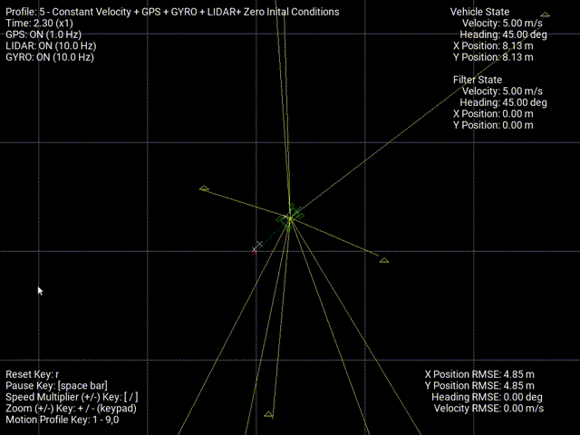
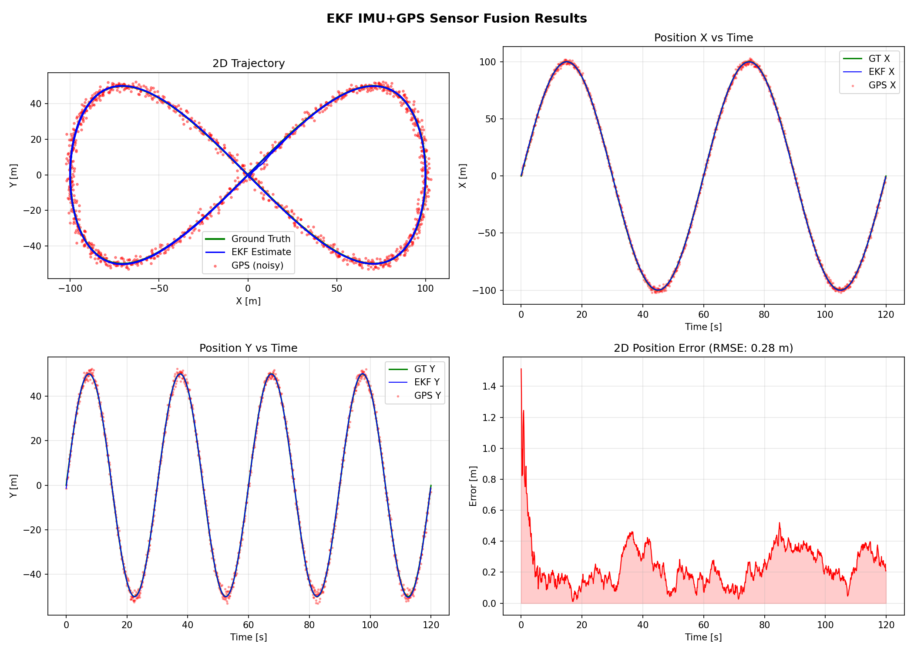
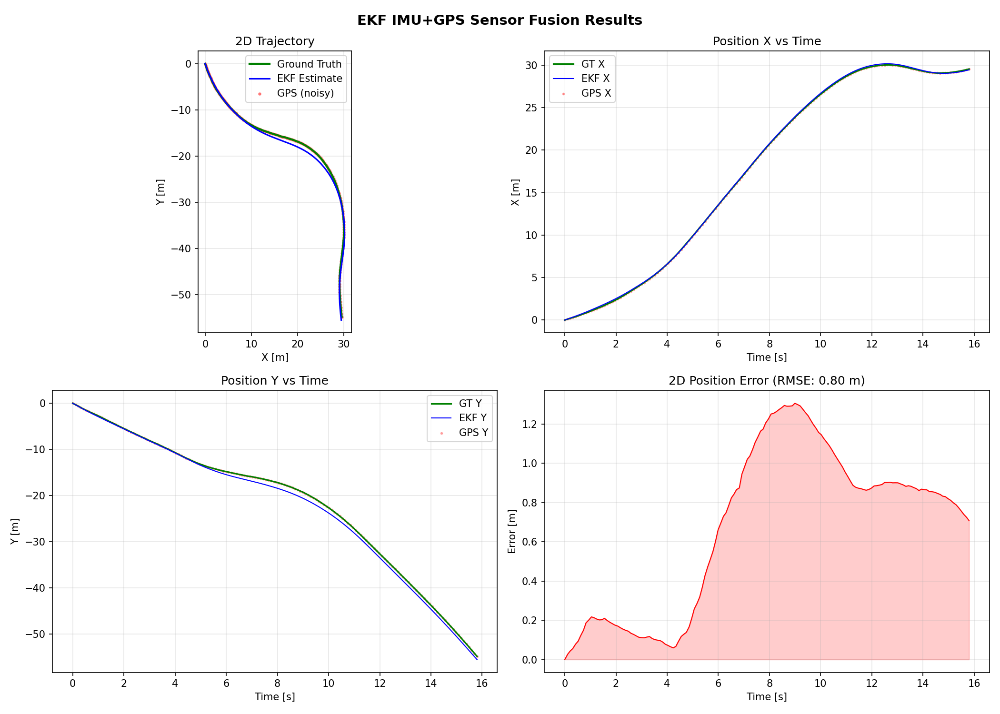

# Advanced Kalman Filtering and Sensor Fusion Tutorial

An educational C++ project collection for learning and implementing **Linear Kalman Filters (LKF)**, **Extended Kalman Filters (EKF)**, and **Unscented Kalman Filters (UKF)** applied to vehicle and robot state estimation with multi-sensor fusion.

## Projects

| # | Project | Description | Sensors | Visualization |
|---|---------|-------------|---------|---------------|
| 00 | [AKFSF Simulation](00.AKFSF-Simulation-CPP/) | 2D vehicle tracking with LKF, EKF, UKF | GPS, Gyro, LIDAR | SDL2 real-time |
| 01 | [EKF Robot Localization](01.EKF-RobotLocalization-CPP/) | Differential drive robot localization | Wheel Encoders, IMU, Range-Bearing | SDL2 real-time |
| 02 | [EKF IMU+GPS Fusion](02.EKF-IMU-GPS-Fusion-CPP/) | 15-state IMU/GPS fusion with bias estimation | IMU (accel+gyro), GPS | Matplotlib plots |

## Project Structure

```
.
├── README.md
├── PDF/                                    # Theory summaries & exercise worksheets
│   ├── Linear+Kalman+Filter+Summary.pdf
│   ├── Extended+Kalman+Filter+Summary.pdf
│   ├── Unscented+Kalman+Filter+Summary.pdf
│   ├── Setting_up_the_C_Development_Environment.pdf
│   ├── Linear+Vehicle+Tracker+*+Exercise.pdf    (3 exercises)
│   ├── 2D+Vehicle+EKF+*+Exercise.pdf            (2 exercises)
│   └── 2D+Vehicle+UKF+*+Exercise.pdf            (2 exercises)
│
├── 00.AKFSF-Simulation-CPP/               # LKF / EKF / UKF vehicle simulation
│   ├── CMakeLists.txt
│   ├── src/
│   │   ├── main.cpp                        # Entry point & SDL2 setup
│   │   ├── simulation.h/cpp                # Simulation orchestrator
│   │   ├── display.h/cpp                   # SDL2 rendering
│   │   ├── car.h                           # Vehicle kinematic model
│   │   ├── sensors.h/cpp                   # GPS, Gyro, LIDAR simulation
│   │   ├── beacons.h/cpp                   # Landmark map for LIDAR
│   │   ├── kalmanfilter.h/cpp              # Filter interface (active impl)
│   │   ├── kalmanfilter_lkf_student.cpp    # LKF student template
│   │   ├── kalmanfilter_lkf_answer.cpp     # LKF reference solution
│   │   ├── kalmanfilter_ekf_student.cpp    # EKF student template
│   │   ├── kalmanfilter_ekf_answer.cpp     # EKF reference solution
│   │   ├── kalmanfilter_ukf_student.cpp    # UKF student template
│   │   ├── kalmanfilter_ukf_answer.cpp     # UKF reference solution
│   │   └── utils.h/cpp                     # Math utilities
│   └── data/
│       └── Roboto-Regular.ttf              # UI font
│
├── 01.EKF-RobotLocalization-CPP/           # EKF robot localization simulation
│   ├── CMakeLists.txt
│   ├── src/
│   │   ├── main.cpp                        # Entry point, 8 simulation profiles
│   │   ├── robot.h                         # Robot state & motion model
│   │   ├── display.h/cpp                   # SDL2 rendering
│   │   ├── landmarks.h/cpp                 # Indoor environment & landmarks
│   │   ├── sensors.h/cpp                   # Wheel encoder, IMU, range-bearing
│   │   ├── kalmanfilter.h/cpp              # EKF implementation
│   │   ├── kalmanfilter_ekf_student.cpp    # Student template
│   │   ├── kalmanfilter_ekf_answer.cpp     # Reference solution
│   │   ├── simulation.h/cpp                # Simulation loop
│   │   └── utils.h/cpp                     # Math utilities
│   └── data/
│       └── Roboto-Regular.ttf              # UI font
│
└── 02.EKF-IMU-GPS-Fusion-CPP/             # 15-state EKF IMU+GPS fusion
    ├── CMakeLists.txt
    ├── src/
    │   ├── main.cpp                        # EKF fusion pipeline
    │   ├── ekf_imu_gps.h                  # 15-state EKF (predict + updateGps)
    │   ├── ekf_types.h                    # Data structures
    │   ├── data_loader.h                  # CSV data loader
    │   ├── generate_fake_data.cpp         # Synthetic trajectory generator
    │   ├── plot_results.py                # Matplotlib visualization
    │   └── convert_kitti.py               # KITTI dataset converter
    └── data/
        ├── fake_data_output/              # Simulated data results
        └── kitti_data_output/             # KITTI dataset results
```

## Getting Started

### Prerequisites

- Ubuntu 20.04+ (or compatible Linux distribution)
- CMake 3.10+
- C++11 compatible compiler

### Install Dependencies

```bash
# Projects 00 & 01 (SDL2 visualization)
sudo apt install libeigen3-dev libsdl2-dev libsdl2-ttf-dev

# Project 02 (Matplotlib plotting)
sudo apt install libeigen3-dev python3-matplotlib python3-numpy
```

### Build & Run

Each project builds independently:

```bash
# Project 00 — AKFSF Simulation
cd 00.AKFSF-Simulation-CPP
mkdir build && cd build && cmake ../ && make
./AKFSF-Simulation

# Project 01 — EKF Robot Localization
cd 01.EKF-RobotLocalization-CPP
mkdir build && cd build && cmake ../ && make
./EKFRobotLocalization

# Project 02 — EKF IMU+GPS Fusion
cd 02.EKF-IMU-GPS-Fusion-CPP
mkdir -p build && cd build && cmake .. && make -j$(nproc)
./generate_fake_data
./ekf_imu_gps_fusion ../data/fake_data_output
cd .. && python3 src/plot_results.py data/fake_data_output
```

---

## Project 00 — AKFSF Simulation



2D vehicle state estimation (position, heading, velocity) with LKF, EKF, and UKF. Real-time SDL2 visualization with covariance ellipses and error tracking.

**State Vectors:**
- LKF: `[X, Y, VX, VY]` — Linear constant velocity model
- EKF/UKF: `[X, Y, Psi, V]` — Nonlinear kinematic bicycle model

**Sensors:** GPS (2D position), Gyroscope (yaw rate), LIDAR (range-bearing to landmarks)

### How to Use

Each filter type has a **student template** and a **reference answer** file:

1. Read the corresponding PDF theory summary and exercise worksheet
2. Copy the student template (e.g. `kalmanfilter_lkf_student.cpp`) over `kalmanfilter.cpp`
3. Implement the Kalman filter equations following the exercise guidance
4. Build and run the simulator to test your implementation
5. Compare with the answer file when needed

### Simulation Profiles

Press number keys `1`-`9`, `0` during simulation:

| Key | Motion Profile | Sensors | Notes |
|-----|---------------|---------|-------|
| 1 | Constant Velocity | GPS + GYRO | Zero initial conditions |
| 2 | Constant Velocity | GPS + GYRO | Non-zero initial conditions |
| 3 | Constant Speed | GPS + GYRO | — |
| 4 | Variable Speed | GPS + GYRO | — |
| 5 | Constant Velocity | GPS + GYRO + LIDAR | Zero initial conditions |
| 6 | Constant Velocity | GPS + GYRO + LIDAR | Non-zero initial conditions |
| 7 | Constant Speed | GPS + GYRO + LIDAR | — |
| 8 | Variable Speed | GPS + GYRO + LIDAR | — |
| 9 | Complex | Multiple | Capstone challenge |
| 0 | Complex | No LIDAR association | Capstone bonus |

### Exercises

#### Linear Kalman Filter (LKF)

| Exercise | Description | Test Profiles |
|----------|-------------|---------------|
| LKF 1 | Initialize filter, implement 2D process model & prediction step | 1 |
| LKF 2 | Implement GPS update step | 1-4 |
| LKF 3 | Initialize on first GPS measurement instead of prediction | 1-2 |

#### Extended Kalman Filter (EKF)

| Exercise | Description | Test Profiles |
|----------|-------------|---------------|
| EKF 1 | Implement nonlinear process model & EKF prediction with Jacobians | 1-4 |
| EKF 2 | Implement LIDAR update step with nonlinear measurement model | 1-8 |

#### Unscented Kalman Filter (UKF)

| Exercise | Description | Test Profiles |
|----------|-------------|---------------|
| UKF 1 | Implement sigma point generation & UKF prediction step | 1-4 |
| UKF 2 | Implement LIDAR update step using sigma points | 1-8 |

#### Capstone

Design and implement a filter that provides the best estimation performance across all profiles, including the challenging profiles 9 and 0.

---

## Project 01 — EKF Robot Localization

Differential drive robot localization in a 20m x 15m indoor environment with walls and 25 landmark pillars. Real-time SDL2 visualization.

**State Vector:** `[px, py, theta]` (position + heading)

**Sensors:** Wheel Encoders (linear velocity), IMU Gyroscope (angular velocity), Range-Bearing Sensor (landmarks)

### Simulation Profiles

Press keys `1`-`8` during simulation:

| Key | Profile | Description |
|-----|---------|-------------|
| 1 | Straight Line | Simple forward motion, all sensors |
| 2 | Square Path | Tests turning behavior |
| 3 | Waypoint Navigation | Multi-room path, all sensors |
| 4 | Dead Reckoning Only | No landmarks — demonstrates drift |
| 5 | High Noise | 4x sensor noise on all channels |
| 6 | IMU Bias + Encoder Drift | Systematic sensor errors |
| 7 | Limited Range + FOV | 5m range, 270 degree field of view |
| 8 | CAPSTONE | All challenges combined |

### Controls

| Key | Action |
|-----|--------|
| `1`-`8` | Load simulation profile |
| `r` | Reset current simulation |
| `Space` | Pause / Resume |
| `]` / `[` | Increase / Decrease speed multiplier |
| `+` / `-` (numpad) | Zoom in / out |
| `Esc` | Quit |

---

## Project 02 — EKF IMU+GPS Fusion

15-state Extended Kalman Filter fusing high-rate IMU (accelerometer + gyroscope) with low-rate GPS (position + velocity). Supports simulated data and real KITTI dataset.

**State Vector (15-state):** Position (3), Velocity (3), Attitude (3), Accelerometer Bias (3), Gyroscope Bias (3)

**Sensors:** IMU at 100 Hz (prediction), GPS at 10 Hz (update)

### Results

| Dataset | 2D Position RMSE | Duration |
|---------|-----------------|----------|
| Simulated (Figure-8) | **0.28 m** | 120 s |
| KITTI drive_0005 | **0.80 m** | ~16 s |




---

## PDF Materials

### Theory Summaries
- **Linear Kalman Filter Summary** — State-space formulation, prediction & update equations
- **Extended Kalman Filter Summary** — Nonlinear models, Jacobian linearization
- **Unscented Kalman Filter Summary** — Sigma point methods, unscented transform

### Exercise Worksheets
Step-by-step guided exercises for initial conditions, prediction steps, and update steps for each filter type.

### Environment Setup
- **Setting up the C++ Development Environment** — Complete setup guide

## Dependencies

- [Eigen3](https://eigen.tuxfamily.org/) — Linear algebra and matrix operations
- [SDL2](https://www.libsdl.org/) — 2D graphics rendering (Projects 00 & 01)
- [SDL2_ttf](https://github.com/libsdl-org/SDL_ttf) — Font rendering (Projects 00 & 01)
- [Python3 + Matplotlib + NumPy](https://matplotlib.org/) — Plotting (Project 02)

## License

This project is licensed under the GNU General Public License v3.0 — see [LICENSE](00.AKFSF-Simulation-CPP/LICENSE) for details.
